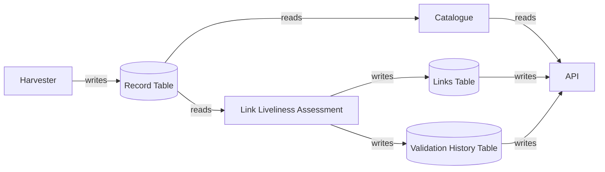
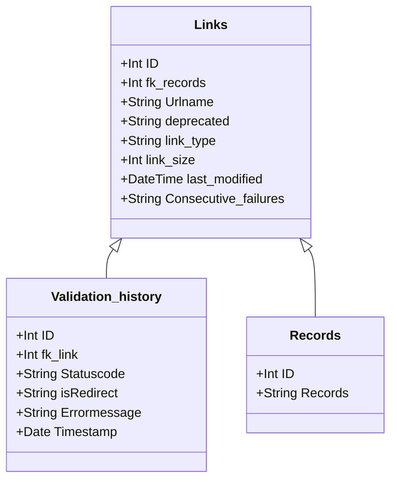

# SoilWise-he Link Liveliness Assessment

The SoilWise-he project aims to develop an open access knowledge and data metadata catalogue to safeguard soils. This repository contains the Link Liveliness Assessment (LLA) component, which monitors and validates the links contained within metadata harvested for the SoilWise Repository (SWR).

## Features
- **Link validation** — Checks each link for availability and collects metadata such as file format, size, and last modification date
- **Broken link categorization** — Classifies broken links by error type: Redirection, Client, or Server errors
- **Deprecated link handling** — Excludes links from future checks after 10 consecutive failures
- **OWS service support** — Applies dedicated handling for OGC web services (WMS, WFS, WCS, and CSW) by detecting their type and quering them with the required parameters aviding treating them as broken links.
- **On-demand validation** — Supports ad-hoc link checks that return instant results without writing to the database
- **Availability history** — Builds a status history for each URL when run periodically

## Installation

### Using Docker (recommended)

1. Clone this repository:
   ```bash
   git clone https://github.com/soilwise-he/link-liveliness-assessment.git
   cd link-liveliness-assessment
   ```

2. Create your environment file and add your database credentials:
   ```bash
      cp .env .env
      # Edit .env with your PostgreSQL credentials and configuration
   ```

3. Build and start the service using Docker:
   ```bash
   docker-compose up --build
   ```
### Local setup
```bash
pip install -r requirements.txt
```
Then set up your `.env` file and ensure PostgreSQL is running and accessible.

## Usage

The LLA component runs automatically as a **weekly CI/CD pipeline**. It can also be triggered manually or used via its FastAPI endpoints.

### Available endpoints

**Check a specific URL on-demand** (no database storage):
```bash
curl -X POST http://<host>:<port>:/check-url \
  -H "Content-Type: application/json" \
  -d '{"url": "https://example.com/dataset", "check_ogc_capabilities": false}'
```
Returns status code, content type, file size, redirect info, and a diagnostic message.

**Query broken links by error type:**
```bash
curl http://<host>:<port>:/Redirection_URLs/3xx
curl http://<host>:<port>:/Client_Error_URLs/4xx
curl http://<host>:<port>:/Server_Errors_URLs/5xx
curl http://<host>:<port>:/Timeout_URLs
```

**Check the status of a specific URL:**
```bash
curl http://<host>:<port>:/status/https://example.com
```

**View the full validation history of a URL:**
```bash
curl "http://<host>:<port>:/URL_status_history?url=https://example.com/dataset&limit=100"
```

**List all deprecated URLs:**
```bash
curl http://<host>:<port>:/Deprecated_URLs
```

The response includes status code, content metadata, redirect information, and diagnostic messages.
### API fields

| Field | Description |
|---|---|
| `link_type` | File format of the resource (e.g., `image/jpeg`, `application/pdf`) |
| `link_size` | Size of the resource in bytes |
| `last_modified` | Timestamp of the resource's last modification |

### Main Component Diagram

```mermaid
flowchart LR
    H["Harvester"]-- "writes" -->MR[("Record Table")]
    MR-- "reads" -->LAA["Link Liveliness Assessment"]
    MR-- "reads" -->CA["Catalogue"]
    LAA-- "writes" -->LLAL[("Links Table")]
    LAA-- "writes" -->LLAVH[("Validation History Table")]
    CA-- "reads" -->API["API"]
    LLAL-- "writes" -->API
    LLAVH-- "writes" -->API
```

### Database design

```mermaid
classDiagram
    Links <|-- Validation_history
    Links <|-- Records
    Links : +Int ID
    Links : +Int fk_records
    Links : +String Urlname
    Links : +String deprecated
    Links : +String link_type
    Links : +Int link_size
    Links : +DateTime last_modified
    Links : +String Consecutive_failures
    class Records{
    +Int ID
    +String Records
    }
    class Validation_history{
      +Int ID
      +Int fk_link
      +String Statuscode
     +String isRedirect
     +String Errormessage
     +Date Timestamp
    }
```

## Additional Information

### Architecture

The LLA component is built with the following stack:

| Technology | Role |
|---|---|
| Python | Linkchecker integration, API development, database interactions |
| PostgreSQL | Primary database for links and validation history |
| FastAPI | REST API with auto-generated Swagger documentation |
| Docker | Containerized deployment |
| CI/CD | Automated weekly pipeline runs |

### Database Design

**Links table** — stores URL metadata per record: `ID`, `fk_records`, `Urlname`, `deprecated`, `link_type`, `link_size`, `last_modified`, `Consecutive_failures`

**Validation_history table** — stores per-check results: `ID`, `fk_link`, `Statuscode`, `isRedirect`, `Errormessage`, `Timestamp`

**Records table** — source metadata records: `ID`, `Records`

### Key Design Decisions

- Only links in the `ogc-api:records` links section are tested (not links embedded in abstracts) to avoid redundant checks across pages.
- OGC services are handled with a dedicated script that appends required parameters before validation.
- DOI and other facade links are followed through to their target page, allowing the tool to understand the DOI-to-resource relationship.
- Links that fail repeatedly are marked as deprecated and excluded from future runs to optimise performance.
- Each link is associated with the record(s) that reference it, enabling targeted notifications when a broken link is found.
- A front-end widget displays the status of each link giving users directl feedback on resource availability.
---
## SoilWise-he Project

This work has been initiated as part of the [SoilWise-he](https://soilwise-he.eu) project. The project receives funding from the European Union's HORIZON Innovation Actions 2022 under grant agreement No. 101112838. Views and opinions expressed are however those of the author(s) only and do not necessarily reflect those of the European Union or Research Executive Agency. Neither the European Union nor the granting authority can be held responsible for them.
