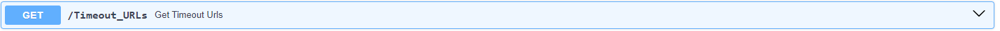

# OGC API - Records; link liveliness assessment tool

## Overview

The linkchecker component is designed to evaluate the validity and accuracy of links within metadata records in the a [OGC API - Records](https://ogcapi.ogc.org/records/) based System. 

A component which evaluates for a set of metadata records, if:

- the links to external sources are valid
- the links within the repository are valid
- link metadata represents accurately the resource

The component either returns a http status: 200 (ok), 401 (non autorized), 404 (not found), 500 (server error)

The component runs an evaluation for a single resource at request, or runs tests at intervals providing a history of availability

A link either points to:

- another metadata record
- a downloadable instance (pdf/zip/sqlite) of the resource
- an API

If endpoint is API, some sanity checks can be performed on the API:

- Identify if the API adopted any API-standard
- If an API standard is adopted, does the API support basic operations of that API
  
The benefit of latter is that it provides more information then a simple ping to the index page of the API, typical examples of standardised API's are SOAP, GraphQL, SPARQL, OpenAPI, WMS, WFS

The results of the validation can be extracted via an API. The API is based on the [fastapi framework](https://fastapi.tiangolo.com/) and can be deployed using a docker container.

***Sample API response*** 
```
    {
        "id": 25,
        "urlname": "https://demo.pycsw.org/gisdata/collections/metadata:main/queryables",
        "parent_urls": [
        "https://demo.pycsw.org/gisdata/collections?f=html"
        ],
        "status": "200 OK",
        "result": "",
        "info": "True",
        "warning": "",
        "deprecated": null
    }
```


## Key Features

1. **Link validation**: 
Returns HTTP status codes for each link, along with other important information such as the parent URL, any warnings, and the date and time of the test.

2. **Broken link categorization**:
Identifies and categorizes broken links based on status codes, including Redirection Errors, Client Errors, and Server Errors.

3. **Deprecated links identification**: 
Flags links as deprecated if they have failed for X consecutive tests, in our case X equals to 10. 
Deprecated links are excluded from future tests to optimize performance.

4. **Timeout management**: 
Allows the identification of URLs that exceed a timeout threshold which can be set manually as a parameter in linkchecker's properties.

5. **Availability monitoring**:
When run periodically, the tool builds a history of availability for each URL, enabling users to view the status of links over time.

6. **OWS services** (WMS, WFS, WCS, CSW) typically return a HTTP 500 error when called without the necessary parameters. A handling for these services has been applied in order to detect and include the necessary parameters before being checked. 


## Run validation locally

A database connection needs to be set up. You can configure the database connection in a .env file (or set environment variables).

```
OGCAPI_URL=https://example.com
OGCAPI_COLLECTION=example
POSTGRES_HOST=example.com
POSTGRES_PORT=5432
POSTGRES_DB=postgres
POSTGRES_USER=postgres
POSTGRES_PASSWORD=******
```

Install requirements

```
pip3 install -r requirements.txt
```

Run the validation

```
python3 linkchecker.py 
```

## Run API locally

To run the FastAPI locally run 

```
python3 -m uvicorn api:app --reload --host 0.0.0.0 --port 8000 
```
The FastAPI service runs on: [http://127.0.0.1:8000/docs]

To view the service of the FastAPI on [http://127.0.0.1:8000/docs]

## Container Deployment

Set environment variables in Dockerfile to enable database connection.

Run the following command:

The app can be deployed as a container. 
A docker-compose file has been implemented.

Run ***docker-compose up*** to run the container

## Deploy `linky` at a path

You can set `ROOTPATH` env var to run the api at a path (default is at root)

```
export ROOTPATH=/linky
```

## CI/CD

A CI/CD configuration file is provided in order to create an automated chronological pipeline.
It is necessary to define the secrets context using GitLab secrets in order to connect to the database.

## Get current URL Status History 

This endpoint returns the history of a specific URL. 
Let's say we have the status of a specific URL over time 

| id  | url                    | validation_result | timestamp               |
|-----|------------------------|-------------------|-------------------------|
| 1   | https://example.com    | 200 OK            | 2023-01-01 10:00:00+00  |
| 2   | https://wikipedia.com  | 404 Not Found     | 2023-01-01 10:00:05+00  |
| 3   | https://example.com    | 200 OK            | 2023-01-02 11:00:00+00  |
| 4   | https://wikipedia.com  | 500 Server Error  | 2023-01-02 11:00:05+00  |
| 5   | https://wikipedia.com  | 200 OK            | 2023-01-02 11:00:10+00  |

Running the `/Single_url_status_history` endpoint for the 
https://wikipedia.com and setting limit = 2 it will fetch the following result:

| id  | url                    | validation_result | timestamp               |
|-----|------------------------|-------------------|-------------------------|
| 1   | https://wikipedia.com  | 500 Server Error  | 2023-01-02 11:00:05+00  |
| 2   | https://wikipedia.com  | 404 Not Found     | 2023-01-01 10:00:05+00  |

This is the URL's history in descenting order in datetime


## Technological Stack

1. **Core Language**:
   - Python: Used for the linkchecker, API, and database interactions.

2. **Database**:
   - PostgreSQL: Utilized for storing and managing information.

3. **Backend Framework**:
   - FastAPI: Employed to create and expose REST API endpoints, utilizing its efficiency and auto-generated components like Swagger.

4. **Containerization**:
   - Docker: Used to containerize the linkchecker application, ensuring deployment and execution across different environments.

## About OGC API - records

OGC is in the process of adopting the [OGC API - Records](https://github.com/opengeospatial/ogcapi-records) specification. 
A standardised API to interact with Catalogues. The specification includes a datamodel for metadata. 
This tool assesses the linkage section of any record in an OGC API - Records.
 
Set the endpoint to be analysed as 2 environment variables

```
export OGCAPI_URL=https://soilwise-he.containers.wur.nl/cat/
export OGCAPI_COLLECTION=metadata:main
```

## Soilwise-he project

This work has been initiated as part of the Soilwise-he project. 
The project receives funding from the European Union’s HORIZON Innovation Actions 2022 under grant agreement No. 101112838.