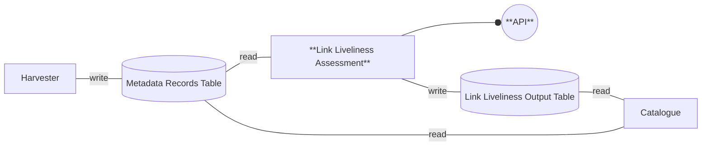
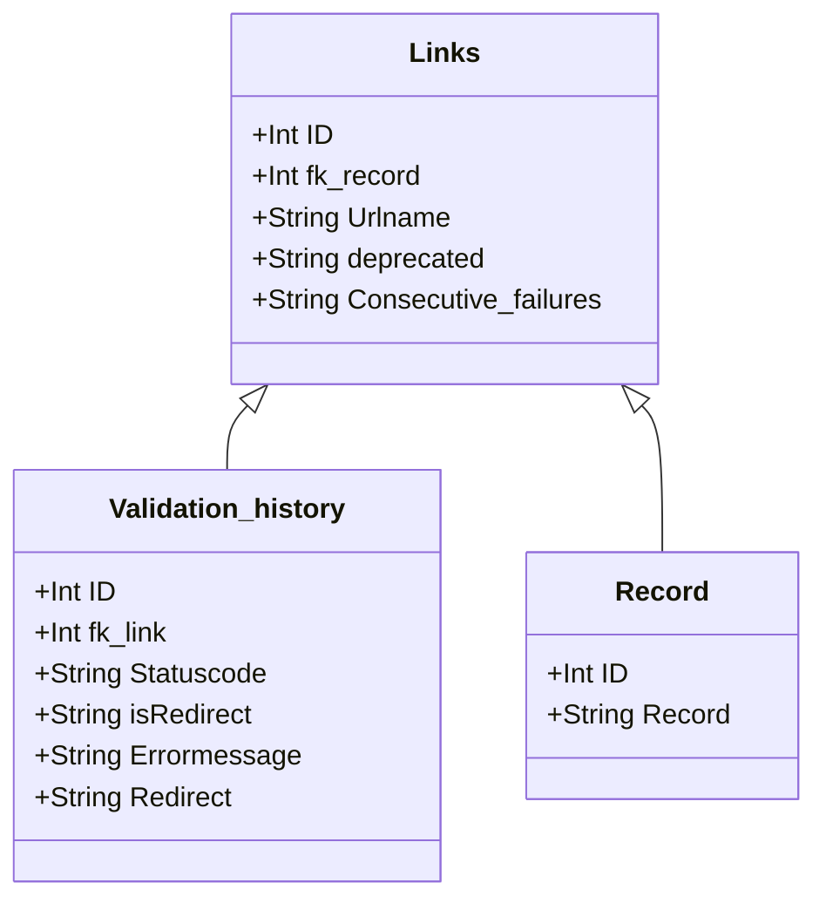

# Design Document: Link Liveliness Assessment

## Introduction

### Component Overview and Scope

The linkchecker component is designed to evaluate the validity and availability of links within metadata records advertised via a [OGC API - Records](https://ogcapi.ogc.org/records/) API.

A link in metadata record either points to:
-	another metadata record
-	a downloadable instance (pdf/zip/sqlite/mp4/pptx) of the resource
   - the resource itself
   - documentation about the resource
   - identifier of the resource (DOI)	   
-	a webservice or API (sparql, openapi, graphql, ogc-api)

Linkchecker evaluates for a set of metadata records, if:
-	the links to external sources are valid
-	the links within the repository are valid
-	link metadata represents accurately the resource (mime type, size, data model, access constraints)

If endpoint is API, some sanity checks can be performed on the API:
-	Identify if the API adopted any API-standard
-	If an API standard is adopted, does the API support basic operations of that API
-	Does the metadata correctly mention the standard

The component returns a http status: `200 OK`, `401 Non Authorized`, `404 Not Found`, `500 Server Error` and timestamp.
The component runs an evaluation for a single resource at request, or runs tests at intervals providing a history of availability.
The results of the evaluation can be extracted via an API. The API is based on the fastapi framework and can be deployed using a docker container.

Evaluation process runs as a scheduled CI-CD pipeline in Gitlab. It uses 5 treads to increase performance. 

### Users
1. **all data users** (authorised + unauthorised)
   - can see the results of link evaluation in the Catalogue (if XX is integrated) or access the API directly to retrieve reports
2. **administrators**
   - can configure and manually start the evaluation process
   - can see the history of link evaluations

### References
-	[OGC API - Records](https://ogcapi.ogc.org/records/)
-	[fastapi framework](https://fastapi.tiangolo.com/)

## Requirements

### Functional Requirements

Users want to understand the availability of a resource before they click a link. It helps them to understand if a click will be (un)successfull. The availability can be indicated as `not available` (404), `sometimes available` (in %), `authorisation required`, `deprecated` (too many times not available), 'unknown' (due to timeouts or other failures).

### Non-functional Requirements

- Should respect rules in robots.txt
- Should not introduce vulnerabilities

## Architecture

### Technological Stack

1. **Core Language**:
   - Python: Used for the linkchecker, API, and database interactions.

2. **Database**:
   - PostgreSQL: Utilized for storing and managing information.

3. **Backend Framework**:
   - FastAPI: Employed to create and expose REST API endpoints, utilizing its efficiency and auto-generated components like Swagger.

4. **Frontend**:
   - See Integrations & Interfaces 

4. **Containerization**:
   - Docker: Used to containerize the linkchecker application, ensuring deployment and execution across different environments.

### Overview of Key Features
1.	**Link validation:** Returns HTTP status codes for each link, along with other important information such as the parent URL, any warnings, and the date and time of the test. 
2.	**Broken link categorization:** Identifies and categorizes broken links based on status codes, including Redirection Errors, Client Errors, and Server Errors. 
3.	**Deprecated links identification:** Flags links as deprecated if they have failed for X consecutive tests, in our case X equals to 10. Deprecated links are excluded from future tests to optimize performance. 
4.	**Timeout management:** Allows the identification of URLs that exceed a timeout threshold which can be set manually as a parameter in linkchecker's properties. 
5.	**Availability monitoring:** When run periodically, the tool builds a history of availability for each URL, enabling users to view the status of links over time. 
6.	OWS services (WMS, WFS, WCS, CSW) typically return a HTTP 500 error when called without the necessary parameters. A handling for these services has been applied in order to detect and include the necessary parameters before being checked.

### Component Diagrams

Link Liveliness Assessment internal flow - TBD

### Database Design

### Integrations & Interfaces
-	Visualisation of evaluation in Metadata Catalogue, the assessment report is retrieved using ajax from the each record page

### Key Architectural Decisions

Initially we started with [linkchecker](https://pypi.org/project/LinkChecker/) library, but performance was really slow, because it tested the same links for each page again and again.
We decided to only test the links section of ogc-api:records, it means that links within for example metadata abstract are no longer tested.
OGC OWS services are a substantial portion of links, these services return error 500, if called without parameters. For this scenario we created a dedicated script.
If tests for a resource fail a number of times, the resource is no longer tested, and the resource tagged as `deprecated`.
Links via a facade, such as DOI, are followed to the page they are referring to. It means the lla tool can understand the relation between DOI and the page it refers to.
For each link it is known on which record(s) it is mentioned, so if a broken link occurs, we can find a contact to notify in the record.

## Risks & Limitations

TBD
